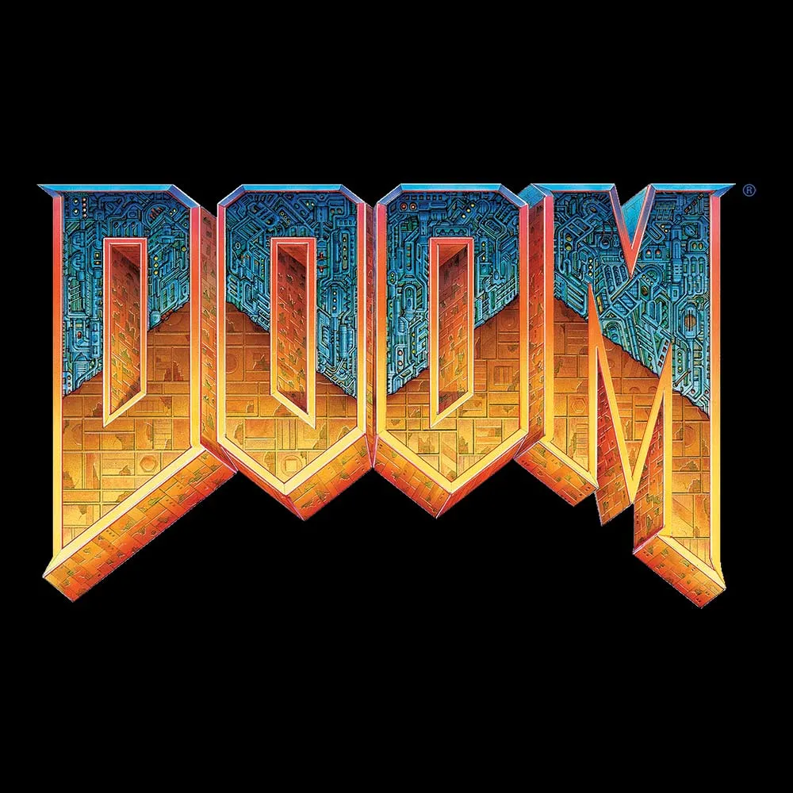

# 😈 vizDoom AI - Gym Reinforcement Learning &nbsp;&nbsp;&nbsp;&nbsp;&nbsp;&nbsp;&nbsp;

vizDoom AI is a study project realized by me at the 3WA, to realize this model of artificial intelligence, I was greatly inspired by the videos of Nicholas Renotte (Youtubeur that I appreciate particularly). The goal of this script is to learn how to play all levels of Doom by himself and be the best he can be. 

- This project is currently **under development.** 🏗️

## 👨‍💻 Technologies

  
  
	
	 
  
  
  

## 🛠️ Prerequisites

- [Python 3](https://www.python.org/downloads/)
- [Pip](https://pip.pypa.io/en/stable/cli/pip_download/)
- [Tensorflow]()
- [VizDoom]()

## 📦 Installation
1 - Clone this repository.  
2 - Install dependencies: `pip install -r requirements.txt`.  
3 - Choose your model in the models folder and configure path in utils/constants  
4 - Run the model: `python play.py`.  
5 - Enjoy! 💡

## 🧠 Models Definitions

### - `./models/basic_0509`

__Description:__ `This model was my first try model trained with the basic configs, use it with basic.cfg only`  
__Training Time__: `2h55min`  
__Number of training steps:__ `100.000`  
__Reward Mean:__ `87.44/101`  

  

### - `./models/defend_center_0509`

__Description:__ `This model was trained in the special level called "Defend Center", the agent got only 3 possibles move (turn_left, turn_right and shot). The Goal is to survive the maximum time in a round room with an infinite ennemies spawn.`  
__Training Time__: `2h03min`  
__Number of training steps:__ `100.000`  
__Reward Mean:__ `15/∞`  

  

